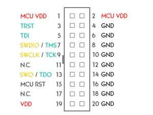

# STM32-inclinometer
## STM32 ARM Cortex-M3 based inclinometer

### 1. Introduction
This project is a crude implementation of an inclinometer.

> An **inclinometer** or **clinometer** is an instrument used for measuring angles of slope, elevation, or depression of an object with respect to gravity's direction. [...]
> 
> Clinometers measure both inclines and declines using three different units of measure: degrees, percentage points, and topos.

Quote : [Wikipedia](https://en.wikipedia.org/wiki/Inclinometer)

### 2. Prerequisites
#### 2.1. Hardware
- A Bluepill (STM32F103 ARM Cortex-M3 development board)
- An ADXL345 accelerometer breakout board
- An SSD1306 128x64 OLED screen breakout board (SPI, not I²C)
- An STLink programmer

#### 2.2. Software (to program only)
- STM32CubeProgrammer
- The latest *.elf firmware file

#### 2.3. Software (to compile)
I've found having **STM32CubeIDE** installed makes it easiest to configure VSCode.

It is shipped with the GNU Arm Embedded Toolchain, the STLink utilities and the STM32CubeProgrammer plugin.

To compile with VSCode, the following is required :
- CMake (minimum version 3.20)
- The Ninja build-system
- VSCode extensions : C/C++ pack, Cortex-Debug, Cmake, CMake Tools

### 3. Operation principles
This devices functions in 4 steps :
1. Wait for the ADXL345 to gather acceleration values in the X, Y and Z axis
2. Compute the angles between G (gravity on the Z axis) and the other axis (X and Y) with an arctangent trigonometric operation
3. Format the angles with their sign and print them on the screen (if the angle changed)
4. Repeat forever

### 4. Wiring

STLink V2 pinout :

STLink to Bluepill wiring :
| STLink V2 pin | STLink V2 pin number | Bluepill pin | Circuit  |
|:-------------:|:--------------------:|:------------:|:--------:|
| MCU VDD       | 1                    | 3V3          |          |
| SWDIO         | 7                    | SWDIO        |          |
| SWCLK         | 9                    | SWCLK        |          |
| VDD           | 19                   |              | VDD rail |
| GND           | 20                   |              | GND rail |

Bluepill to peripherals wiring :
| STM32/Bluepill pin | Alternate use | ADXL345 pin | SSD1306 pin |
|:------------------:|:-------------:|:-----------:|:-----------:|
| PA4                | SPI1 NSS      | CS          |             |
| PA5                | SPI1 SCK      | SCL         |             |
| PA6                | SPI1 MISO     | SDO         |             |
| PA7                | SPI1 MOSI     | SDA         |             |
| PB0                | GPIO output   | INT1        |             |
| PB12               | SPI2 NSS      |             | CS          |
| PB13               | SPI2 SCK      |             | D0          |
| PB15               | SPI2 MOSI     |             | D1          |
| PA9                | GPIO output   |             | D/C         |
| PA10               | GPIO output   |             | RES         |

Note : Two different SPI are used because, while the SSD1306 can go at full speed, the ADXL345 can go at max. 5MHz.

In addition, SPI2 is a transmit-only master because the SSD1306 does not allow any read operation in serial mode. 
