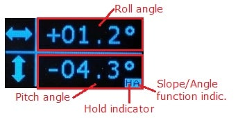

# Leany
## STM32 ARM Cortex-M3 based inclinometer

### 1. Introduction
This project is a crude implementation of an inclinometer.

> An **inclinometer** or **clinometer** is an instrument used for measuring angles of slope, elevation, or depression of an object with respect to gravity's direction. [...]
> 
> Clinometers measure both inclines and declines using three different units of measure: degrees, percentage points, and topos.

Quote : [Wikipedia](https://en.wikipedia.org/wiki/Inclinometer)

### 2. Features
- **Measurements** : Pitch and roll rotation axes with a precision up to 0.1°
- **Hold function** : Holds the screen refresh updates
- **Slope mode** : Angles with respect to gravity (absolute measurements)
- **Angle mode** : Difference between the current angles and the angles at which the device has been zeroed (relative measurements)

### 3. Measurements screen

